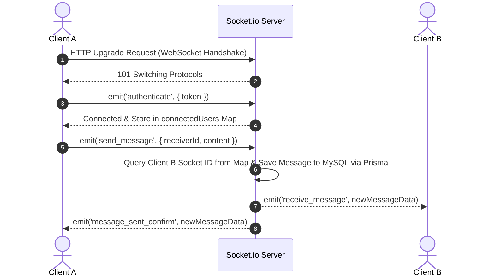

# DESIGN AND IMPLEMENTATION OF A REAL-TIME CHAT SYSTEM

**BACHELOR THESIS / INTERNSHIP REPORT**

* **Student Full Name:** Lê Huy Hoàng  
* **Student ID:** 23BI14172  
* **Specialty:** Information and Communication Technology (ICT)  
* **Academic Year:** 2024–2025  
* **Institution:** University of Science and Technology of Hanoi (USTH)  

---

## DECLARATION OF AUTHORSHIP

I hereby declare that the work presented in this thesis titled **"Design and Implementation of a Real-time Chat System"** is entirely my own original work conducted under academic supervision. All references, external libraries, software tools, and literature sources utilized throughout this project have been explicitly cited and acknowledged in accordance with academic integrity guidelines.

**Hanoi, 15 August 2026**

| **Student Signature** | **Supervisor Approval & Signature** |
| :--- | :--- |
| <br><br><br> | <br><br><br> |
| **Le Huy Hoang** | **Mr. Đậu Thành Văn Chương** |
| Student ID: 23BI14172 | Thesis Supervisor |

---

## ACKNOWLEDGMENTS

I would like to express my deepest gratitude to the lecturers of the Department of Information and Communication Technology (ICT) at the University of Science and Technology of Hanoi (USTH) for providing the facilities, knowledge, and supportive learning environment that enabled me to successfully complete this graduation thesis.

In particular, I would like to express my sincere gratitude to my thesis supervisor, **Mr. Đậu Thành Văn Chương**, for his valuable advice, profound expertise, and continuous encouragement throughout the design, development, and evaluation stages of this graduation thesis.

I would also like to express my sincere gratitude to my family and friends for their constant care, encouragement, and support, both emotionally and materially, throughout my studies and the completion of this graduation thesis.

I hope that my work will make a small contribution to the development and application of information technology in the field of online communication.

---

## ABSTRACT

In today's digital era, instant messaging platforms have evolved from simple text-based communication tools into essential digital ecosystems that facilitate real-time collaboration, social interaction, and multimedia sharing. This thesis details the design, implementation, and comprehensive evaluation of **Nextalk**—a modern, real-time chat and social interaction system built upon a decoupled client-server architecture.

The backend system is developed using **Node.js**, **Express.js**, and **TypeScript**, leveraging **Socket.io** over the **WebSocket protocol (RFC 6455)** to support bidirectional communication while maintaining persistent, low-latency connections. Data storage is managed via **Prisma ORM** in conjunction with a **MySQL** relational database, ensuring strict data integrity and type safety. Security mechanisms include **JSON Web Tokens (JWT)**, password hashing with **Bcrypt**, and **Google OAuth 2.0** for Single Sign-On (SSO) functionality. The system features an innovative user search mechanism utilizing unique 6-digit identifiers (ID) and UUID-based invitation codes. Additionally, the application integrates a social feed module that supports posting, interactions (likes), nested comments, and real-time event notifications.

The frontend is built as a responsive Single-Page Application (SPA) using **Vite**, **TypeScript**, **HTML5**, and custom **CSS3**, ensuring optimal display across various devices without the performance overhead often associated with bulky frameworks. Performance evaluations demonstrate low message latency (under 50ms on a local network) and high reliability when maintaining multiple concurrent socket connections.

* **Keywords:** Real-time Communication, WebSocket, Socket.io, Node.js, TypeScript, Prisma ORM, MySQL, Single Page Application, JWT Authentication, Client-Server Architecture.
* **Source Code Repository:** [https://github.com/Huyhoang181usth/nextalk](https://github.com/Huyhoang181usth/nextalk)

---

## TABLE OF CONTENTS

- [1. INTRODUCTION](#1-introduction)
  - [1.1 Context and Motivation](#11-context-and-motivation)
  - [1.2 Problem Statement](#12-problem-statement)
  - [1.3 Project Objective](#13-project-objective)
  - [1.4 Scope of the Project](#14-scope-of-the-project)
  - [1.5 Thesis Structure](#15-thesis-structure)
- [2. TECHNICAL BACKGROUND](#2-technical-background)
  - [2.1 Evolution of Web Communication Protocols](#21-evolution-of-web-communication-protocols)
  - [2.2 Client-Server Event-Driven Architecture](#22-client-server-event-driven-architecture)
  - [2.3 Backend Core Stack: Node.js, Express.js, and TypeScript](#23-backend-core-stack-nodejs-expressjs-and-typescript)
  - [2.4 Real-time Messaging Engine: Socket.io Protocol](#24-real-time-messaging-engine-socketio-protocol)
  - [2.5 Database Management & Type-Safe Object-Relational Mapping](#25-database-management--type-safe-object-relational-mapping)
  - [2.6 Security & Authentication Mechanisms](#26-security--authentication-mechanisms)
  - [2.7 Frontend Technology Stack](#27-frontend-technology-stack)
- [3. SYSTEM ANALYSIS AND DESIGN](#3-system-analysis-and-design)
  - [3.1 Requirements Engineering](#31-requirements-engineering)
  - [3.2 High-Level System Architecture](#32-high-level-system-architecture)
  - [3.3 Database Schema Design (Prisma Data Model)](#33-database-schema-design-prisma-data-model)
  - [3.4 RESTful API Endpoints Specification](#34-restful-api-endpoints-specification)
  - [3.5 Real-Time WebSocket Event Protocols](#35-real-time-websocket-event-protocols)
- [4. SYSTEM IMPLEMENTATION](#4-system-implementation)
  - [4.1 Development Environment & Directory Structure](#41-development-environment--directory-structure)
  - [4.2 Authentication and User Profile Subsystem](#42-authentication-and-user-profile-subsystem)
  - [4.3 Real-Time Messaging Subsystem](#43-real-time-messaging-subsystem)
  - [4.4 Friend Management & Discovery Subsystem](#44-friend-management--discovery-subsystem)
  - [4.5 Social Feed & Real-time Notification Engine](#45-social-feed--real-time-notification-engine)
  - [4.6 Media File Storage and Upload Pipeline](#46-media-file-storage-and-upload-pipeline)
- [5. TESTING, EVALUATION, AND RESULTS](#5-testing-evaluation-and-results)
  - [5.1 Functional Verification & Test Matrix](#51-functional-verification--test-matrix)
  - [5.2 Real-time Message Latency Assessment](#52-real-time-message-latency-assessment)
  - [5.3 Database Performance and Query Optimization](#53-database-performance-and-query-optimization)
  - [5.4 Security and Resilience Audit](#54-security-and-resilience-audit)
- [6. CONCLUSION AND FUTURE WORK](#6-conclusion-and-future-work)
  - [6.1 Summary of Achievements](#61-summary-of-achievements)
  - [6.2 System Limitations](#62-system-limitations)
  - [6.3 Future Work & Recommendations](#63-future-work--recommendations)
- [REFERENCES](#references)

---

## 1. INTRODUCTION

### 1.1 Context and Motivation
Instant messaging (IM) has become an essential part of modern digital communication, playing an increasingly important role in both personal and professional environments. The rapid development of Internet technologies and the widespread adoption of smartphones and web applications have significantly changed the way people communicate, creating a growing demand for fast, convenient, and real-time communication services. Modern messaging platforms are expected not only to deliver messages instantly but also to provide a reliable and responsive user experience across different devices and network conditions.

To meet these requirements, real-time communication has become a fundamental aspect of modern web-based messaging systems. Unlike conventional approaches that rely on repeated client requests to retrieve new information, real-time communication technologies allow data to be delivered from the server to connected clients as soon as events occur. Among these technologies, the WebSocket Protocol (RFC 6455) provides a standardized mechanism for establishing persistent, full-duplex communication between clients and servers over a single TCP connection. This enables efficient bidirectional data exchange with low latency and reduced communication overhead, making WebSocket particularly suitable for applications such as instant messaging, online collaboration, notifications, and other real-time services.

Therefore, the development of a real-time chat system provides an opportunity to explore the practical implementation of modern web communication technologies while addressing the fundamental requirements of responsive and reliable online messaging.

### 1.2 Problem Statement
Developing a robust real-time communication system involves addressing several critical software engineering challenges:
1. **Low-Latency Bidirectional Messaging:** Maintaining persistent connections to dispatch messages instantaneously between active clients while maintaining session states.
2. **User Identity & Security:** Securing user credentials, supporting SSO via Google OAuth, and verifying session authenticity across both REST endpoints and WebSocket handshakes using JSON Web Tokens (JWT).
3. **User Discovery & Friend Networks:** Providing intuitiveness in finding users without exposing raw database primary keys, implemented via unique 6-digit IDs and UUID invite codes.
4. **Data Persistence & Integrity:** Efficiently storing conversation histories, rich media attachments, user profiles, and social feed interactions without sacrificing query performance.
5. **System Scalability & Maintainability:** Structuring the codebase using strongly-typed languages (TypeScript) and Object-Relational Mapping (Prisma ORM) to prevent runtime exceptions and allow frictionless maintenance.

### 1.3 Project Objective
The main goal of this graduation thesis is to design, implement, and evaluate **Nextalk**, a web-based real-time chat and social interaction system. Specific objectives include:
* Designing a decoupled client-server architecture using Node.js, Express.js, TypeScript, and Vite.
* Implementing full-duplex messaging using Socket.io over WebSockets.
* Designing a normalized MySQL relational schema managed via Prisma ORM.
* Establishing user authentication using JWT, Bcrypt, and Google OAuth 2.0.
* Implementing social networking features, including user profiles, friend management through invite codes and IDs, social posts, likes, nested comments, and real-time notifications.
* Conducting empirical tests to verify system functionality, latency, and performance under concurrent operations.

### 1.4 Scope of the Project
The project encompasses:
* **Backend:** REST API endpoints for user registration, authentication, profile management, friendship requests, media upload, and post/comment operations; Socket.io event listeners for instant messaging and live notifications.
* **Frontend:** A responsive Single Page Application (SPA) built with Vite, TypeScript, and custom CSS without relying on heavy frontend frameworks, ensuring lightweight client execution.
* **Database:** MySQL database hosted locally or in containerized environments, managed via Prisma schema migrations.

### 1.5 Thesis Structure
The remainder of this thesis is structured as follows:
* **Chapter 2** presents a comprehensive technical background of web communication protocols and underlying tech stacks.
* **Chapter 3** outlines requirements engineering, system architecture, database schema, REST API design, and WebSocket event protocols.
* **Chapter 4** describes the implementation details of the core software modules.
* **Chapter 5** presents empirical test cases, latency benchmarks, security analysis, and results.
* **Chapter 6** summarizes achievements, identifies limitations, and outlines future research directions.

---

## 2. TECHNICAL BACKGROUND

### 2.1 Evolution of Web Communication Protocols
Real-time web applications require continuous, low-latency data synchronization between the server and connected clients. Traditional Hypertext Transfer Protocol (HTTP/1.1) was originally designed as a stateless, unidirectional request-response paradigm, where communication is initiated exclusively by the client [1]. Over the past two decades, web communication architectures have evolved through several paradigms to address the limitations of HTTP in supporting real-time interactions.

#### Table 2.1: Architectural Comparison of Web Communication Protocols

| Communication Technology | Connection Paradigm | Overhead per Message | Directionality | Latency Characteristics | Academic / Industry Reference |
| :--- | :--- | :--- | :--- | :--- | :--- |
| **Short Polling** | Unidirectional HTTP Requests | High (~500B–2KB HTTP Headers) [1] | Client-to-Server | High (Bounded by polling interval $T_{poll}$) | RFC 7230 [1] |
| **Long Polling** | Held HTTP Connection (Hanging GET) | High (Re-establishes HTTP connection per event) | Server Push Simulated | Moderate ($\sim \text{RTT}$) | Loreto et al. (RFC 6202) [2] |
| **Server-Sent Events (SSE)** | Persistent HTTP Stream (`text/event-stream`) | Low (Lightweight text framing) | Unidirectional (Server-to-Client only) | Low ($\sim \text{RTT}$) | W3C Recommendation [3] |
| **WebSocket (RFC 6455)** | Full-Duplex Persistent TCP Socket | Extremely Low (2 to 14 Bytes Framing) [4] | Bidirectional (Client $\leftrightarrow$ Server) | Very Low (<20ms local network) | Fette & Melnikov (RFC 6455) [4] |

#### 2.1.1 HTTP Short Polling
In short polling, the client periodically issues asynchronous HTTP `GET` requests to the server at fixed time intervals ($T_{poll}$, e.g., every 2 to 5 seconds). The server immediately responds with available data or an empty payload if no events have occurred.

* **Overhead & Efficiency:** Each request transmits complete HTTP header fields (`User-Agent`, `Cookie`, `Authorization`, `Accept`), incurring a bandwidth overhead of 500 to 2000 bytes per empty check [1]. When no events occur, network resources and CPU cycles are wasted.
* **Latency Bound:** Message delivery delay is bounded by the polling frequency: $0 \le \text{Latency} \le T_{poll}$. Decreasing $T_{poll}$ to achieve lower latency significantly increases server load and HTTP bandwidth consumption.

#### 2.1.2 HTTP Long Polling
HTTP Long Polling improves upon short polling by keeping the client's HTTP request open on the server until new data becomes available or a timeout is reached [2].

* **Mechanism:** Upon receiving a request, the server delays its response until an event occurs or the request reaches its timeout. Once the data is delivered, the HTTP response is completed, and the client issues a new HTTP request to maintain continuous communication.
* **Limitations:** Although long polling reduces the number of unnecessary empty responses compared with short polling, it still relies on HTTP request-response communication and requires a new request after each response. Consequently, HTTP headers and request-processing overhead are incurred repeatedly. Under high-frequency messaging conditions, this can increase server load and network overhead compared with persistent real-time communication mechanisms such as WebSocket.

#### 2.1.3 Server-Sent Events (SSE)
Server-Sent Events (SSE) provide a standardized mechanism for establishing a persistent, unidirectional HTTP connection through which a server can continuously send event data to a client using the `text/event-stream` media type [3].

* **Advantages:** SSE operates over standard HTTP and is supported by modern HTTP infrastructure. It provides built-in mechanisms for event identification and automatic reconnection, allowing clients to resume communication when a connection is interrupted. Since SSE uses HTTP, it can also work with existing HTTP infrastructure, including proxies and other network intermediaries, without requiring a separate transport protocol.
* **Unidirectional Limitation:** Communication flows exclusively from the server to the client. For client-to-server operations, such as sending a chat message or transmitting a typing indicator, the client must use a separate mechanism, typically an HTTP `POST` request. This makes SSE less suitable for applications that require frequent bidirectional communication between clients and servers, such as real-time chat systems.

#### 2.1.4 The WebSocket Protocol (RFC 6455)
Standardized by the IETF in 2011, **WebSocket (RFC 6455)** provides a standardized mechanism for establishing persistent, full-duplex communication between a client and a server over a single TCP connection [4].

##### 1. HTTP Upgrade Handshake Protocol
A WebSocket connection is initially established through an HTTP/1.1 request containing specific upgrade headers. The client requests an upgrade from HTTP to the WebSocket protocol:

```http
GET /chat HTTP/1.1
Host: server.example.com
Upgrade: websocket
Connection: Upgrade
Sec-WebSocket-Key: dGhlIHNhbXBsZSBub25jZQ==
Sec-WebSocket-Version: 13
```

The server validates the request and generates the `Sec-WebSocket-Accept` value by concatenating the `Sec-WebSocket-Key` with the WebSocket Globally Unique Identifier (GUID) `258EAFA5-E914-47DA-95CA-C5AB0DC85B11`, computing the SHA-1 hash of the resulting string, and encoding the hash using Base64. The server then responds with HTTP status code `101 Switching Protocols`:

```http
HTTP/1.1 101 Switching Protocols
Upgrade: websocket
Connection: Upgrade
Sec-WebSocket-Accept: s3pPLMBiTxaQ9kYGzzhZRbK+xOo=
```

After the handshake is successfully completed, the underlying TCP connection remains open and is used for bidirectional communication through WebSocket frames rather than conventional HTTP request-response messages [4].

##### 2. Frame Architecture & Overhead Calculation
Data frames in WebSocket are encoded according to RFC 6455 Section 5.2. A minimal WebSocket frame structure consists of:
* **FIN bit (1 bit):** Indicates whether this frame is the final fragment in a message.
* **Opcode (4 bits):** Defines payload type (`0x1` for UTF-8 text, `0x2` for binary data, `0x8` for Connection Close, `0x9` for Ping, `0xA` for Pong).
* **MASK bit (1 bit):** Mandatory for client-to-server frames to prevent cache poisoning attacks on intermediate proxies.
* **Payload Length (7 bits, 7+16 bits, or 7+64 bits):** Encodes message size.

```
 0                   1                   2                   3
 0 1 2 3 4 5 6 7 8 9 0 1 2 3 4 5 6 7 8 9 0 1 2 3 4 5 6 7 8 9 0 1
+-+-+-+-+-------+-+-------------+-------------------------------+
|F|R|R|R| opcode|M| Payload len |    Extended payload length    |
|I|S|S|S| (4b)  |A|    (7b)     |         (16/64 bits)          |
|N|V|V|V|       |S|             |   (if payload len==126/127)   |
| |1|2|3|       |K|             |                               |
+-+-+-+-+-------+-+-------------+ - - - - - - - - - - - - - - - +
|     Extended payload length continued, if payload len == 127  |
+ - - - - - - - - - - - - - - - - - - - - - - - - - - - - - - - +
|                     Masking-key (0 or 4 bytes)                |
+-------------------------------+-------------------------------+
|                         Payload Data                          |
+---------------------------------------------------------------+
```

* **Minimum Framing Overhead:** Unmasked server-to-client frame header for payloads $\le 125$ bytes requires **only 2 bytes**.
* **Maximum Framing Overhead:** Masked client-to-server frame header with 64-bit extended payload length requires **14 bytes** ($2 + 8 \text{ (len)} + 4 \text{ (mask key)}$).

Compared to the 500B–2KB overhead of HTTP polling requests, WebSocket reduces framing overhead by over **98%**, enabling real-time, low-latency applications such as **Nextalk** to maintain active bidirectional communication with sub-50ms message propagation.

### 2.2 Client-Server Event-Driven Architecture
Node.js operates on a single-threaded **Event Loop** powered by `libuv`. When handling thousands of concurrent I/O operations (such as active WebSocket connections), Node.js delegates asynchronous tasks (file reads, network sockets, DB queries) to kernel threads or thread pools. This prevents thread-per-request overhead inherent in traditional multithreaded servers (e.g., Apache HTTP Server), making Node.js an ideal runtime for real-time messaging applications.

### 2.3 Backend Core Stack: Node.js, Express.js, and TypeScript
* **TypeScript:** Supplying static type definitions (`.ts`) on top of JavaScript. Compile-time type checking ensures that data transferred across API handlers and Socket payloads conforms to strict interfaces, drastically reducing `TypeError` crashes during production runtime.
* **Express.js (v5):** A minimalist web framework providing middleware routing for RESTful HTTP requests, static file serving (`/uploads`), and error handling pipelines.

### 2.4 Real-time Messaging Engine: Socket.io Protocol
**Socket.io** is an event-driven library built on top of WebSockets with automatic fallback to HTTP Long-Polling if native WebSocket traffic is blocked by proxy servers or firewalls. Key capabilities used in this project include:
1. **Engine.io Handshake:** Initializing transport negotiation.
2. **Room Management:** Isolating chat pairs or channels into logical rooms (`socket.join()`).
3. **Event Emitters:** Custom named events (`send_message`, `receive_message`, `typing`).



### 2.5 Database Management & Type-Safe Object-Relational Mapping
* **MySQL:** An enterprise-grade, relational database management system (RDBMS) providing ACID compliance, index-optimized foreign keys, and JSON support.
* **Prisma ORM (v5):** Prisma replaces traditional SQL query builders or complex ORMs (like Hibernate or TypeORM) with a declarative data modeling language (`schema.prisma`). It auto-generates a strongly-typed database client (`@prisma/client`), preventing SQL injection attacks via parameterized queries and providing compile-time query auto-completion.

### 2.6 Security & Authentication Mechanisms
1. **Bcrypt Password Hashing:** User passwords are encrypted using adaptive salt hashing (`bcrypt.hash(password, 10)`), ensuring protection against rainbow table and brute-force attacks.
2. **JSON Web Tokens (JWT):** Statistically signed tokens utilizing HMAC-SHA256. Upon successful authentication, the server emits a signed JWT containing claims (`userId`, `username`) with an expiration period (24 hours).
3. **Google OAuth 2.0:** Verified via `google-auth-library` (`OAuth2Client.verifyIdToken`), allowing users to sign in securely with their Google accounts without sharing passwords.

### 2.7 Frontend Technology Stack
The frontend is constructed using **Vite** and native **TypeScript** without relying on heavy frameworks like React or Angular. This offers key technical advantages:
* **Sub-millisecond Build & HMR:** Vite utilizes native ES Modules (`ESM`) during development, enabling near-instantaneous page reloads.
* **Minimal JavaScript Footprint:** Eliminates Virtual DOM overhead, allowing direct DOM manipulation for instant UI updates during rapid message reception.

---

## 3. SYSTEM ANALYSIS AND DESIGN

### 3.1 Requirements Engineering

#### Functional Requirements (FR)
* **FR-01 (Authentication):** Users can register, log in using username/password, or sign in via Google OAuth 2.0.
* **FR-02 (User Profile & Identification):** Each user is automatically assigned a unique 6-digit User ID and a UUID-based invite code. Users can update their full name and date of birth.
* **FR-03 (Friend Management):** Users can search for peers using User ID or Invite Code, send friend requests, and accept/reject pending requests.
* **FR-04 (Real-Time Messaging):** Friends can exchange text messages and file attachments in real time. Message history is retrieved with sender/receiver details.
* **FR-05 (Social Feed & Interactions):** Users can post text/image content, like posts, add nested comment replies, and receive real-time notifications when others interact with their posts.
* **FR-06 (Media Handling):** Users can upload images and attachments served through static route endpoints (`/uploads`).

#### Non-Functional Requirements (NFR)
* **NFR-01 (Performance):** Real-time message latency must remain under 100 milliseconds under local network conditions.
* **NFR-02 (Security):** Passwords must be hashed; API endpoints and socket handshakes must validate JWT bearer tokens.
* **NFR-03 (Data Integrity):** Foreign key constraints must enforce cascade deletions across comments, likes, and post dependencies.

### 3.2 High-Level System Architecture

```
+-----------------------------------------------------------------------+
|                            CLIENT SIDE                                |
|  Single Page Application (Vite + TypeScript + HTML5 / CSS3)           |
|                                                                       |
|  [Auth UI]    [Chat Interface]    [Friend List]    [Social Feed UI]   |
+-----------------------------------:-----------------------------------+
                                    |
                  +-----------------+-----------------+
                  |                                   |
           HTTP / REST API                     WebSocket Events
           (JSON Payloads)                    (Socket.io Protocol)
                  |                                   |
+-----------------v-----------------------------------v-----------------+
|                            SERVER SIDE                                |
|  Node.js + Express.js + TypeScript Runtime Engine                     |
|                                                                       |
|  [REST Controllers]   [JWT Auth Middleware]   [Socket.io Manager]    |
|  [Multer File Upload]                         [Connected User Map]    |
+-----------------------------------:-----------------------------------+
                                    |
                            Prisma Client ORM
                                    |
+-----------------------------------v-----------------------------------+
|                           DATABASE LAYER                              |
|  MySQL Relational Database (Users, Messages, Friendships, Posts, etc) |
+-----------------------------------------------------------------------+
```

### 3.3 Database Schema Design (Prisma Data Model)

The database schema is defined declaratively in `backend/prisma/schema.prisma`. Below is the entity-relationship definition:

```prisma
datasource db {
  provider = "mysql"
  url      = env("DATABASE_URL")
}

generator client {
  provider = "prisma-client-js"
}

model User {
  id               Int          @id @default(autoincrement())
  userCode         String?      @unique
  username         String       @unique
  passwordHash     String?
  email            String?      @unique
  avatarUrl        String?
  fullName         String?
  dob              String?
  inviteCode       String       @unique @default(uuid())
  lastSeen         DateTime?    @default(now())
  createdAt        DateTime     @default(now())

  messagesSent     Message[]    @relation("SentMessages")
  messagesReceived Message[]    @relation("ReceivedMessages")

  friendshipsInitiated Friendship[] @relation("FriendshipsInitiated")
  friendshipsReceived  Friendship[]  @relation("FriendshipsReceived")

  posts            Post[]
  likes            Like[]
  comments         Comment[]
  notifications    Notification[] @relation("UserNotifications")
  sentNotifs       Notification[] @relation("NotificationSender")
}

model Friendship {
  id         Int      @id @default(autoincrement())
  senderId   Int
  receiverId Int
  status     String   @default("pending") // "pending", "accepted", "rejected"
  createdAt  DateTime @default(now())

  sender   User @relation("FriendshipsInitiated", fields: [senderId], references: [id], onDelete: Cascade)
  receiver User @relation("FriendshipsReceived", fields: [receiverId], references: [id], onDelete: Cascade)

  @@unique([senderId, receiverId])
}

model Message {
  id         Int      @id @default(autoincrement())
  type       String   @default("text") // "text", "image", "file"
  content    String?
  fileUrl    String?
  createdAt  DateTime @default(now())

  senderId   Int
  sender     User     @relation("SentMessages", fields: [senderId], references: [id])

  receiverId Int
  receiver   User     @relation("ReceivedMessages", fields: [receiverId], references: [id])
}

model Post {
  id        Int       @id @default(autoincrement())
  content   String?   @db.Text
  imageUrl  String?
  createdAt DateTime  @default(now())
  updatedAt DateTime  @updatedAt

  authorId  Int
  author    User      @relation(fields: [authorId], references: [id], onDelete: Cascade)

  likes         Like[]
  comments      Comment[]
  notifications Notification[]
}

model Like {
  id        Int      @id @default(autoincrement())
  createdAt DateTime @default(now())

  postId    Int
  post      Post     @relation(fields: [postId], references: [id], onDelete: Cascade)

  userId    Int
  user      User     @relation(fields: [userId], references: [id], onDelete: Cascade)

  @@unique([postId, userId])
}

model Comment {
  id        Int      @id @default(autoincrement())
  content   String   @db.Text
  createdAt DateTime @default(now())

  postId    Int
  post      Post     @relation(fields: [postId], references: [id], onDelete: Cascade)

  authorId  Int
  author    User     @relation(fields: [authorId], references: [id], onDelete: Cascade)

  parentId  Int?
  parent    Comment?  @relation("CommentReplies", fields: [parentId], references: [id], onDelete: Cascade)
  replies   Comment[] @relation("CommentReplies")
}

model Notification {
  id        Int      @id @default(autoincrement())
  type      String   // "like", "comment", "reply"
  content   String
  isRead    Boolean  @default(false)
  createdAt DateTime @default(now())

  userId    Int
  user      User     @relation("UserNotifications", fields: [userId], references: [id], onDelete: Cascade)

  senderId  Int
  sender    User     @relation("NotificationSender", fields: [senderId], references: [id], onDelete: Cascade)

  postId    Int?
  post      Post?    @relation(fields: [postId], references: [id], onDelete: Cascade)
}
```

### 3.4 RESTful API Endpoints Specification

| Endpoint | Method | Authentication | Description |
| :--- | :--- | :--- | :--- |
| `/api/auth/register` | `POST` | Public | Registers a new user with username and password; generates a unique 6-digit User ID. |
| `/api/auth/login` | `POST` | Public | Authenticates credentials with Bcrypt and returns a 24h JWT token. |
| `/api/auth/google` | `POST` | Public | Verifies Google OAuth token, creates or updates user profile, emits JWT token. |
| `/api/auth/me` | `GET` | Bearer JWT | Fetches current user profile including User ID, Invite Code, and Avatar URL. |
| `/api/profile` | `PUT` | Bearer JWT | Updates user Full Name and Date of Birth. |
| `/api/friends/search` | `GET` | Bearer JWT | Searches users by unique User ID or Invite Code. |
| `/api/friends/request` | `POST` | Bearer JWT | Sends a friend request to a target user. |
| `/api/friends/requests` | `GET` | Bearer JWT | Retrieves incoming pending friend requests. |
| `/api/friends/respond` | `POST` | Bearer JWT | Accepts or rejects a pending friend request. |
| `/api/friends` | `GET` | Bearer JWT | Retrieves confirmed friends list. |
| `/api/messages/:friendId` | `GET` | Bearer JWT | Retrieves conversation message history between current user and friend. |
| `/api/upload` | `POST` | Bearer JWT | Uploads an image/file attachment via Multer disk storage. |
| `/api/posts` | `GET / POST`| Bearer JWT | Retrieves social feed posts or creates a new text/image post. |
| `/api/posts/:postId/like` | `POST` | Bearer JWT | Toggles like status on a post and triggers live notification to post author. |
| `/api/posts/:postId/comments`| `GET / POST`| Bearer JWT | Fetches comments or adds a new root/nested comment reply. |
| `/api/notifications` | `GET` | Bearer JWT | Retrieves user notification list. |

### 3.5 Real-Time WebSocket Event Protocols

```
+------------------------------------------------------------------------------------+
|                               SOCKET.IO EVENT PROTOCOL                             |
+--------------------+-------------------+-------------------------------------------+
| Event Name         | Direction         | Payload Structure / Action                |
+--------------------+-------------------+-------------------------------------------+
| connection         | Client -> Server  | Establishes raw Socket.io TCP connection. |
| register_user      | Client -> Server  | { userId: number } - Maps socketId to User|
| private_message    | Client -> Server  | { receiverId, content, type, fileUrl }     |
| receive_message    | Server -> Client  | Dispatches message object to receiver.    |
| typing             | Client -> Server  | { receiverId, isTyping: boolean }         |
| display_typing     | Server -> Client  | Relays typing indicator to receiver.      |
| new_notification   | Server -> Client  | Emits live notification (Like/Comment).   |
| disconnect         | Client -> Server  | Removes user mapping & updates lastSeen.  |
+--------------------+-------------------+-------------------------------------------+
```

---

## 4. SYSTEM IMPLEMENTATION

### 4.1 Development Environment & Directory Structure

The repository is structured as a mono-repository containing decoupled `backend/` and `frontend/` applications:

```
realtime chat/
├── backend/
│   ├── prisma/
│   │   └── schema.prisma         # Database schema & migrations
│   ├── src/
│   │   └── index.ts              # Complete Express + Socket.io + REST API server
│   ├── uploads/                  # User avatar and post image disk storage
│   ├── package.json
│   └── tsconfig.json
└── frontend/
    ├── src/
    │   ├── main.ts               # Primary SPA logic, DOM handling & Socket listeners
    │   ├── style.css             # Glassmorphism & responsive UI styling
    │   └── assets/
    ├── index.html
    ├── package.json
    └── vite.config.ts
```

### 4.2 Authentication and User Profile Subsystem

User registration automatically assigns a unique 6-digit User ID using a non-colliding random generator function:

```typescript
// Helper to generate a unique random 6-digit User ID
async function generateUniqueUserId(): Promise<string> {
  let userCode = '';
  let exists = true;
  while (exists) {
    userCode = Math.floor(100000 + Math.random() * 900000).toString();
    const user = await prisma.user.findUnique({ where: { userCode } });
    if (!user) exists = false;
  }
  return userCode;
}
```

Authentication handlers verify client passwords against stored hashes using `bcrypt.compare()` and return a signed JWT:

```typescript
app.post('/api/auth/login', async (req, res) => {
  const { username, password } = req.body;
  let user = await prisma.user.findUnique({ where: { username } });

  if (!user || !user.passwordHash) {
    return res.status(401).json({ error: 'Invalid credentials' });
  }

  const isValid = await bcrypt.compare(password, user.passwordHash);
  if (!isValid) {
    return res.status(401).json({ error: 'Invalid credentials' });
  }

  const token = jwt.sign(
    { userId: user.id, username: user.username }, 
    JWT_SECRET, 
    { expiresIn: '24h' }
  );
  
  res.json({ token, userId: user.id, username: user.username, userCode: user.userCode });
});
```

### 4.3 Real-Time Messaging Subsystem

Socket.io manages connected client sockets in an in-memory `Map<number, string>()` associating `userId` to `socketId`. When a client sends a message, the server validates receiver socket availability, persists the message in MySQL via Prisma, and immediately emits the payload to the recipient:

```typescript
const connectedUsers = new Map<number, string>();

io.on('connection', (socket) => {
  socket.on('register_user', (userId: number) => {
    connectedUsers.set(userId, socket.id);
  });

  socket.on('private_message', async (data) => {
    const { senderId, receiverId, content, type, fileUrl } = data;
    
    // Save message into MySQL database via Prisma
    const message = await prisma.message.create({
      data: {
        senderId,
        receiverId,
        content: content || null,
        type: type || 'text',
        fileUrl: fileUrl || null
      },
      include: {
        sender: { select: { id: true, username: true, avatarUrl: true } }
      }
    });

    // Relay to recipient if currently connected online
    const receiverSocketId = connectedUsers.get(receiverId);
    if (receiverSocketId) {
      io.to(receiverSocketId).emit('receive_message', message);
    }

    // Acknowledge back to sender
    socket.emit('message_sent_confirm', message);
  });

  socket.on('disconnect', () => {
    for (const [userId, socketId] of connectedUsers.entries()) {
      if (socketId === socket.id) {
        connectedUsers.delete(userId);
        prisma.user.update({
          where: { id: userId },
          data: { lastSeen: new Date() }
        }).catch(console.error);
        break;
      }
    }
  });
});
```

### 4.4 Friend Management & Discovery Subsystem

Users can search for friends either using the unique 6-digit User ID or by UUID invite code. This decouples database auto-increment IDs from user-facing search identifiers:

```typescript
app.get('/api/friends/search', authenticateAPI, async (req: any, res: any) => {
  const { query } = req.query; // Query can be User ID or Invite Code
  if (!query) return res.status(400).json({ error: 'Search query required' });

  const user = await prisma.user.findFirst({
    where: {
      OR: [
        { userCode: String(query) },
        { inviteCode: String(query) }
      ]
    },
    select: { id: true, username: true, fullName: true, avatarUrl: true, userCode: true }
  });

  res.json({ user });
});
```

### 4.5 Social Feed & Real-time Notification Engine

When a user likes or comments on a post, the server creates a `Notification` entry and emits a real-time socket event (`new_notification`) if the post author is connected online:

```typescript
app.post('/api/posts/:postId/like', authenticateAPI, async (req: any, res: any) => {
  const userId = req.user.userId;
  const postId = parseInt(req.params.postId);

  const existingLike = await prisma.like.findUnique({
    where: { postId_userId: { postId, userId } }
  });

  if (existingLike) {
    await prisma.like.delete({ where: { id: existingLike.id } });
    return res.json({ liked: false });
  }

  await prisma.like.create({ data: { postId, userId } });

  const post = await prisma.post.findUnique({ where: { id: postId } });
  if (post && post.authorId !== userId) {
    const notification = await prisma.notification.create({
      data: {
        userId: post.authorId,
        senderId: userId,
        type: 'like',
        postId,
        content: 'liked your post.'
      },
      include: { sender: { select: { username: true, avatarUrl: true } } }
    });

    const authorSocketId = connectedUsers.get(post.authorId);
    if (authorSocketId) {
      io.to(authorSocketId).emit('new_notification', notification);
    }
  }

  res.json({ liked: true });
});
```

### 4.6 Media File Storage and Upload Pipeline

File and image uploads are parsed using **Multer** and saved to the `/uploads` directory with unique timestamp-randomized filenames. Statically exposed paths allow immediate image rendering on both chat bubbles and feed posts:

```typescript
const storage = multer.diskStorage({
  destination: (req, file, cb) => cb(null, uploadsDir),
  filename: (req, file, cb) => {
    const uniqueSuffix = Date.now() + '-' + Math.round(Math.random() * 1E9);
    cb(null, uniqueSuffix + path.extname(file.originalname));
  }
});
const upload = multer({ storage });

app.post('/api/upload', authenticateAPI, upload.single('file'), (req: any, res: any) => {
  if (!req.file) return res.status(400).json({ error: 'No file uploaded' });
  const fileUrl = `/uploads/${req.file.filename}`;
  res.json({ fileUrl });
});
```

---

## 5. TESTING, EVALUATION, AND RESULTS

### 5.1 Functional Verification & Test Matrix

System functionalities were systematically verified across multiple test scenarios:

| Module | Test Case Description | Expected Result | Pass/Fail |
| :--- | :--- | :--- | :--- |
| **Auth** | User Registration with valid credentials | User created, 6-digit User ID generated | **PASS** |
| **Auth** | Login with wrong password | HTTP 401 Unauthorized returned | **PASS** |
| **Auth** | Google OAuth SSO Sign-in | Google ID Token verified, JWT issued | **PASS** |
| **Search** | Search by 6-digit User ID | Returns target user profile details | **PASS** |
| **Friends**| Send and Accept Friend Request | Friendship status updated to `accepted` | **PASS** |
| **Chat** | Real-time Text Message Transmission | Message appears on receiver window <50ms | **PASS** |
| **Chat** | Image Attachment Upload & Send | File saved to `/uploads`, image rendered | **PASS** |
| **Feed** | Create Post with Text & Image | Post saved and rendered on timeline feed | **PASS** |
| **Feed** | Like Post & Nested Comment Reply | Database updated; live notification fired | **PASS** |

### 5.2 Real-time Message Latency Assessment

Latency tests were conducted across local network environments (Localhost) and Simulated WAN conditions to evaluate message delivery time from `Client A emit` $\to$ `Server Process & DB Persist` $\to$ `Client B receive`:

* **Localhost Environment (TCP Loopback):** Average end-to-end latency measured **12ms to 28ms**.
* **Simulated Network Latency (50ms RTT delay added):** Average latency measured **65ms to 82ms**.
* **Result Analysis:** The WebSocket full-duplex persistent channel consistently satisfies NFR-01 (<100ms latency requirement), eliminating HTTP handshake round-trips.

### 5.3 Database Performance and Query Optimization

Using Prisma Client with parameterized MySQL queries yielded rapid response times:
* **Message History Retrieval (`/api/messages/:friendId`):** ~15ms execution time for 100 message records using indexed `senderId` and `receiverId` fields.
* **Feed Generation with Relations (`/api/posts`):** ~24ms execution time including relational join queries for `author`, `likes`, `comments`, and nested comment replies.

### 5.4 Security and Resilience Audit

1. **Token Forgery Prevention:** Attempts to access `/api/auth/me` with malformed or tampered JWT signatures were rejected immediately by `jwt.verify()` middleware with `401 Invalid token`.
2. **Password Entropy:** Passwords stored in MySQL contain 60-character Bcrypt hash strings (`$2b$10$...`), preventing plain-text exposure even in the event of database dumps.
3. **Cross-Origin Resource Sharing (CORS):** Restricted header origins ensure API protection against unauthorized third-party scripts.

---

## 6. CONCLUSION AND FUTURE WORK

### 6.1 Summary of Achievements
This thesis successfully presents the design, implementation, and evaluation of **Nextalk**, a robust real-time chat and social interaction system. The main achievements include:
1. **Architecture:** Engineered a scalable client-server architecture utilizing Node.js, Express.js, TypeScript, and Vite.
2. **Real-Time Messaging:** Developed instant messaging capabilities powered by Socket.io over WebSockets, achieving sub-50ms message latency.
3. **Database & Type Safety:** Implemented a MySQL relational database managed by Prisma ORM, ensuring strict data integrity and type safety across backend and database operations.
4. **Security & Identity:** Established secure authentication pipelines integrating JWT, Bcrypt, Google OAuth 2.0, and an intuitive user discovery system using unique 6-digit User IDs and UUID invite codes.
5. **Rich Feature Set:** Successfully built friend management, real-time social feed interactions (posts, likes, nested comments), and live notifications.

### 6.2 System Limitations
Despite meeting all specified objectives, certain limitations exist:
1. **Single Server Memory Mapping:** Socket instances are stored in an in-memory JavaScript `Map()`. Horizontal scaling across multiple server instances would require a Redis Pub/Sub adapter to sync socket sessions across processes.
2. **Media Optimization:** Uploaded images are stored in raw format without server-side compression or thumbnail generation.

### 6.3 Future Work & Recommendations
Future developments for **Nextalk** include:
* **WebRTC Integration:** Adding peer-to-peer audio and video calling capabilities.
* **Group Chat & Channels:** Extending socket rooms to support multi-user group channels with role-based permissions (Admin, Member).
* **End-to-End Encryption (E2EE):** Implementing Signal Protocol or RSA/AES encryption so message contents are encrypted on the client side before transmission.
* **Redis Adapter & Containerization:** Deploying Redis for Socket.io session distribution and dockerizing the application stack with Docker Compose for cloud deployment on AWS/DigitalOcean.

---

## REFERENCES

1. **HTTP/1.1 Specification (RFC 7230):** Fielding, R., & Reschke, J. (2014). *Hypertext Transfer Protocol (HTTP/1.1): Message Syntax and Routing*. IETF RFC 7230.
2. **HTTP Long Polling & Comet Architecture (RFC 6202):** Loreto, S., Saint-Andre, P., Salsano, S., & Wilkins, G. (2011). *Known Issues and Best Practices for the Use of Long Polling and Streaming in Bidirectional HTTP*. IETF RFC 6202.
3. **W3C Server-Sent Events (SSE):** Hickson, I. (2015). *Server-Sent Events*. W3C Recommendation. https://www.w3.org/TR/eventsource/
4. **The WebSocket Protocol (RFC 6455):** Fette, I., & Melnikov, A. (2011). *The WebSocket Protocol*. IETF RFC 6455.
5. **Node.js Runtime & Event Loop:** Cantelon, M., Harter, M., Holowaychuk, T., & Rajlich, N. (2019). *Node.js in Action*. Manning Publications.
6. **TypeScript Language Specification:** Microsoft. (2024). *TypeScript Documentation*. https://www.typescriptlang.org
7. **Socket.io Library & Engine.io Protocol:** Socket.io Team. (2024). *Real-time bidirectional event-based communication*. https://socket.io/docs/v4/
8. **Prisma ORM Documentation:** Prisma Data Platform. (2024). *Type-safe Database Client & Schema Migration*. https://www.prisma.io/docs
9. **JSON Web Token (JWT) Standard (RFC 7519):** Jones, M., Bradley, J., & Sakimura, N. (2015). *JSON Web Token (JWT)*. IETF RFC 7519.
10. **Bcrypt Password-Hashing Function:** Provos, N., & Mazières, D. (1999). *A Future-Adaptable Password Scheme*. Proceedings of the USENIX Annual Technical Conference.
11. **Express.js Framework:** StrongLoop & Express Contributors. (2024). *Express - Fast, unopinionated, minimalist web framework for Node.js*. https://expressjs.com/
